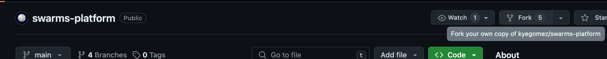
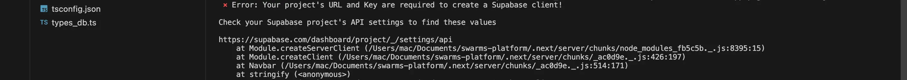
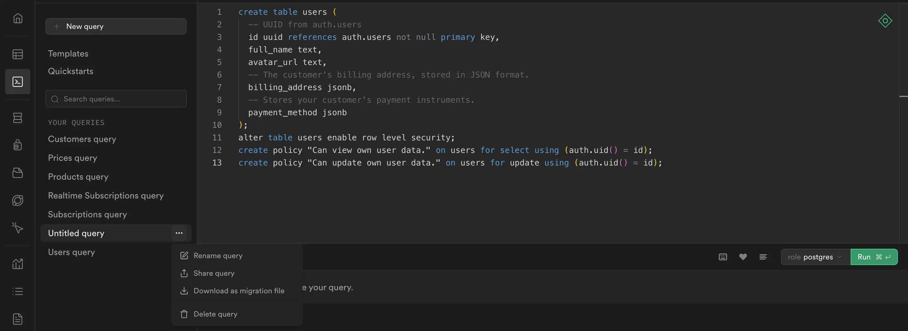

# Contributing Guidelines

We value your input and appreciate your willingness to contribute to this open source project. To ensure that the contribution process is easy and effective for everyone involved, we request that you take a moment to review this document. Following these guidelines shows that you respect the time and effort put in by the developers to manage and develop this project.

It's important to note that this document is not a set of arbitrary rules that must be followed blindly. Rather, it's a written version of the agreed-upon standards.
Of course, this document is subject to change as it's a living document. You're free to submit pull requests to this document as well..

## Table of Contents

- [What do I need to know to contribute?](#what-do-i-need-to-know-to-contribute)
  - [Installation](#installation)
- [Setting up Supabase](#setting-up-supabase)
  - [Authentication](#authentication)
  - [Working with Providers](#working-with-providers)
    - [Setting up Github OAuth](#setting-up-github-oauth)
    - [Setting up Google OAuth](#setting-up-google-oauth)
- [Using the issue tracker](#using-the-issue-tracker)
  - [Bug reports](#bug-reports)
  - [Feature requests](#feature-requests)
  - [Pull requests](#pull-requests)
- [License](#license)
- [Your Support means a lot](#your-support-means-a-lot)

## What do I need to know to contribute?

Never made an open source contribution before? Are you wondering how to contribute to this project? No worries! Here's what you need.

### Installation

1.  Fork the repo, clone your fork, and configure the remotes:
    

    ```sh
    # Clone your fork of the repo into the current directory
    git clone https://github.com/<your-username>/swarms-platform
    # Navigate to the newly cloned directory
    cd swarms-platform
    ```

2.  If you cloned a while ago, get the latest changes from origin `main`:

    ```sh
    git checkout <main-branch>
    git pull origin <main-branch>
    ```

3.  Create a new branch (off the main project branch) to contain your feature, change, or fix:

    ```sh
    git checkout -b <new-branch-name>
    ```

4.  Install the dependencies

    > As Swarms Platform uses an npm package manager, it is believed you've a node stable version installed, [install node](https://nodejs.org/en/download)

    ```sh
    npm install
    ```

5.  Make .env.local file in root directory with these variables

    > This step is NOT optional, Add this step if you want to run the complete web application in your terminal

    ```
    NEXT_PUBLIC_SUPABASE_ANON_KEY=
    NEXT_PUBLIC_SUPABASE_URL=
    SUPABASE_SERVICE_ROLE_KEY=
    ```

6.  Make and commit your changes following the [WARP](https://github.com/kyegomez/WARP?tab=readme-ov-file#warp) format.
    Please adhere to these guideline when it comes to [commit Structure](https://github.com/kyegomez/WARP?tab=readme-ov-file#types-of-changes) with [examples](https://github.com/kyegomez/WARP?tab=readme-ov-file#examples) and [best commit practices](https://github.com/kyegomez/WARP?tab=readme-ov-file#best-practices-for-using-warp).

7.  Locally merge (or rebase) the main branch into your working branch:

    ```sh
    git pull origin main
    ```

8.  Push your working branch up to your fork:

    ```sh
    git push -u origin <branch-name>
    ```

9.  [Open a Pull Request](https://github.com/kyegomez/swarms-platform/pulls)
    with a clear title and description.

    > **IMPORTANT**: By submitting a patch, you agree to allow the project owner or maintainer to license your work under the same license as that used by the project.

10. Wait for the pull request to be reviewed by us and make appropriate changes if the maintainer recommends you to and submit it.

## Setting up Supabase

As mentioned previously, [Supabase](https://supabase.com/) is the main database used for the project's dashboard.

**We highly encourage you to set up your personal database on Supabase if you are contributing to the dashboard**.
If you are not familiar with Supabase, don't worry, it's easy to set up.

We have provided some helpful materials to guide you through the process.

1. [Supabase Docs](m/docs/guides/getting-started/quickstarts/nextjs)
2. [FreeCodeCamp - Learn Supabase](https://www.freecodecamp.org/news/learn-supabase-open-source-firebase-alternative/)

> **IMPORTANT:** To note that no page can be viewed on the browser without values for the env variables:
> NEXT_PUBLIC_SUPABASE_ANON_KEY & NEXT_PUBLIC_SUPABASE_URL

You may come across the error shown below in your local machine or terminal.


```
⨯ Error: Your project's URL and Key are required to create a Supabase client!
Check your Supabase project's API settings to find these values
```

> **Note:** _You can use random values for viewing non-protected pages on your browser._

### Authentication

Access to the Swarms platform's dashboard requires authentication via Supabase. There are three authentication providers to choose from: Email (manual input), GitHub, and Google.

To get started:

1. Copy the provided [schema](./schema.sql) containing the user's data table.

   ```sh
   create table users (
     -- UUID from auth.users
     id uuid references auth.users not null primary key,
     full_name text,
     avatar_url text,
     -- The customer's billing address, stored in JSON format.
     billing_address jsonb,
     -- Stores your customer's payment instruments.
     payment_method jsonb
   );
   alter table users enable row level security;
   create policy "Can view own user data." on users for select using (auth.uid() = id);
   create policy "Can update own user data." on users for update using (auth.uid() = id);
   ```

2. Move the schema to the SQL editor column in your Supabase project dashboard.
   

   > _We recommend renaming your query to users_

3. Paste the schema into the code editor.
4. Click "Run".
5. Check the "Table" column to view your newly created table.
6. Assign the right values to the supabase environment variables listed above

### Working with providers

#### Setting up Github OAuth

To configure your GitHub client ID and client secrets, we recommend following the steps outlined in either the [Supabase Docs](https://supabase.com/docs/guides/auth/social-login/auth-github) or [Github Docs](https://docs.github.com/en/apps/oauth-apps/building-oauth-apps/creating-an-oauth-app).

**Note** that when setting the "Authorization callback URL" parameter to "https://<reference*id>.supabase.co/auth/v1/callback", the "\_https://<reference_id>.supabase.co*" part of the URL is taken from the API column in the project settings of the Supabase dashboard.

The GitHub client ID and secret are also important, as they are used as values if GitHub is set up as a provider within the Supabase Authentication column

#### Setting up Google OAuth

To set up Google as a provider on Supabase, we recommend following the instructions in the [Supabase Docs](https://supabase.com/docs/guides/auth/social-login/auth-google).

Once set up correctly, access to the dashboard is authorized for your contributions.

## Using the issue tracker

The repository [issue](https://github.com/kyegomez/swarms-platform/issues) page is the preferred channel for [bug reports](#bugs),
[features requests](#features) and [submitting pull
requests](#pull-requests), but please respect the following restrictions:

- Please **do not** use the issue tracker for personal support requests (use [Stack Overflow](http://stackoverflow.com) or AI models specifically for help including [ChatGPT](https://chat.openai.com/), [Blackbox](https://www.blackbox.ai/)).

- Please **do not** derail or troll issues. Keep the discussion on topic and respect the opinions of others.

### Bug reports

A bug refers to _an issue in the code_ that exists in the repository and _can be demonstrated_.
<br />
Good bug reports are extremely helpful—thank you!

Guidelines for bug reports:

1. **Use the GitHub issue search tool** — check if the issue has already been reported.

2. **Check if the issue has been fixed** — try to reproduce it using the latest `main` or `dev` branch in the repository.

3. **Isolate the problem** — create a [reduced test case](http://css-tricks.com/reduced-test-cases/) and in some extreme cases, a live example.

“Programs are meant to be read by humans and only incidentally for computers to execute.” — Harold Abelson

A good bug report should be comprehensive and not leave room for others to seek additional information from you. Please try to be as detail-oriented as possible in your report.

> 1. What is your environment?
> 2. What steps will reproduce the issue?
> 3. What browser(s) and OS experience the problem? What would you expect to be the outcome?
>    Providing these details will assist in resolving potential bugs.

Example:

> Short and descriptive example bug report title
>
> A summary of the issue and the browser/OS environment in which it occurs. If
> suitable, include the steps required to reproduce the bug.
>
> 1. This is the first step
> 2. This is the second step
> 3. Further steps, etc.
>
> Any other information you want to share that is relevant to the issue being reported.
> This might include the lines of code that you have identified as causing the bug,
> and potential solutions (and your opinions on their merits).

### Feature requests

We welcome feature requests, but before submitting one, please ensure that your idea aligns with the project's scope and objectives. It is _your responsibility_ to persuade the developers of the feature's benefits by presenting a compelling argument. Please provide as much detail and context as possible.

### Pull requests

Pull requests are the best way to propose changes to the codebase. We actively welcome your pull requests. They should remain focused in scope and avoid containing unrelated commits.

**Please ask first** before embarking on any significant pull request such as implementing new features or refactoring code, it is essential to discuss the changes with the repository owners through our channels on [Discord](https://discord.com/channels/999382051935506503/999387347978301551).

Please adhere to the coding conventions used throughout the project (indentation, accurate comments, etc.) and any other requirements (such as maintaining the file structure).

## License

This project is licensed under the terms of the [MIT license](https://opensource.org/license/mit/). The MIT license is a permissive free software license that allows you to use, copy, modify, merge, publish, distribute, sublicense, and/or sell copies of the software. It is a simple and short license that is compatible with most open source licenses and is widely used in the open source community.

The MIT license includes a disclaimer of liability, meaning that the project's authors or contributors cannot be held liable for any damages that may arise from the use of the software. It also requires that any copies or modifications of the software include the same license terms and copyright notice as the original software.

## Your Support means a lot

Give a ⭐ to the project if you liked it.
