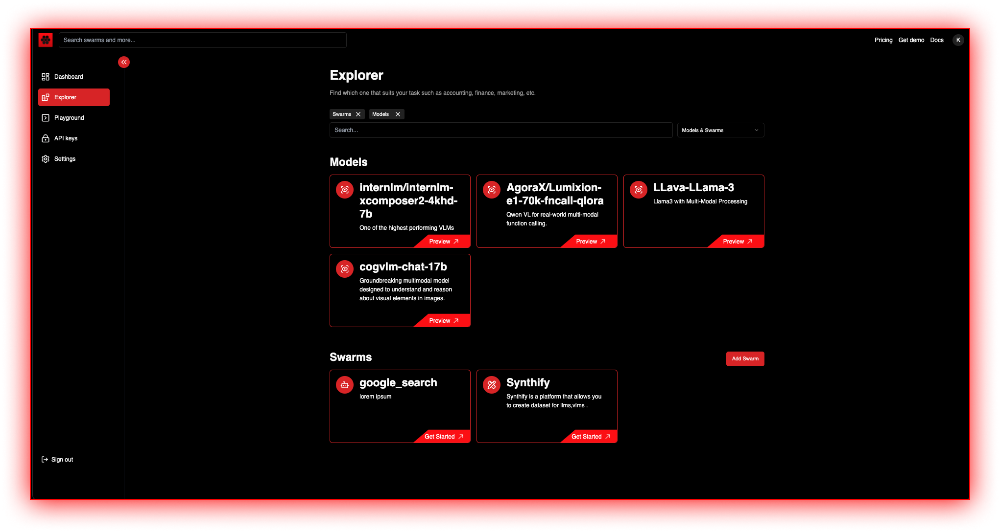

<div align="center">
  <a href="https://swarms.world">
    <h1>Swarms Platform Marketplace</h1>
  </a>
</div>
<p align="center">
  <em>The Agentic Labor Marketplace </em>
</p>

<p align="center">
    <a href="https://pypi.org/project/swarms/" target="_blank">
        
        
    </a>
</p>
<p align="center">
<a href="https://twitter.com/swarms_corp/">🐦 Twitter</a>
<span>&nbsp;&nbsp;•&nbsp;&nbsp;</span>
<a href="https://discord.gg/agora-999382051935506503">📢 Discord</a>
<span>&nbsp;&nbsp;•&nbsp;&nbsp;</span>
<a href="https://swarms.world">Swarms Platform</a>
<span>&nbsp;&nbsp;•&nbsp;&nbsp;</span>
<a href="https://docs.swarms.world">📙 Documentation</a>
</p>

[](https://discord.gg/agora-999382051935506503) [](https://www.youtube.com/@kyegomez3242) [](https://www.linkedin.com/in/kye-g-38759a207/) [](https://x.com/kyegomezb)

[](https://github.com/kyegomez/swarms-platform/issues) [](https://github.com/kyegomez/swarms-platform/network) [](https://github.com/kyegomez/swarms-platform/stargazers) [](https://github.com/kyegomez/swarms-platform/blob/main/LICENSE)[](https://star-history.com/#kyegomez/swarms)[](https://libraries.io/github/kyegomez/swarms) [](https://pepy.tech/project/swarms)

[](https://twitter.com/intent/tweet?text=Check%20out%20this%20amazing%20AI%20project:%20&url=https%3A%2F%2Fgithub.com%2Fkyegomez%2Fswarms) [](https://www.facebook.com/sharer/sharer.php?u=https%3A%2F%2Fgithub.com%2Fkyegomez%2Fswarms) [](https://www.linkedin.com/shareArticle?mini=true&url=https%3A%2F%2Fgithub.com%2Fkyegomez%2Fswarms&title=&summary=&source=)

[](https://www.reddit.com/submit?url=https%3A%2F%2Fgithub.com%2Fkyegomez%2Fswarms&title=Swarms%20-%20the%20future%20of%20AI) [](https://news.ycombinator.com/submitlink?u=https%3A%2F%2Fgithub.com%2Fkyegomez%2Fswarms&t=Swarms%20-%20the%20future%20of%20AI) [](https://pinterest.com/pin/create/button/?url=https%3A%2F%2Fgithub.com%2Fkyegomez%2Fswarms&media=https%3A%2F%2Fexample.com%2Fimage.jpg&description=Swarms%20-%20the%20future%20of%20AI) [](https://api.whatsapp.com/send?text=Check%20out%20Swarms%20-%20the%20future%20of%20AI%20%23swarms%20%23AI%0A%0Ahttps%3A%2F%2Fgithub.com%2Fkyegomez%2Fswarms)



## 🚀 Our Vision

Swarms Platform Marketplace is revolutionizing the AI agent ecosystem by creating the first decentralized marketplace for autonomous agents. We're building the infrastructure that enables developers worldwide to:

- 🛠️ **Create & Deploy**: Build sophisticated AI agents using our robust development framework
- 💰 **Monetize**: Set your own pricing and earn revenue from your agent creations
- 🔄 **Share & Exchange**: Connect with other developers and share agent capabilities
- 🔍 **Discover**: Find and integrate pre-built agents for any task or industry
- 🤝 **Collaborate**: Join a thriving community of agent developers and innovators

## ✨ Why Swarms Platform?

- **Open Economy**: True ownership and monetization of your AI agents
- **Composability**: Mix and match agent capabilities to create powerful workflows
- **Quality Assurance**: Built-in testing and verification systems
- **Developer-First**: Comprehensive SDK and development tools
- **Community-Driven**: Active ecosystem of developers and users

## 🛠️ Quick Start

```bash
git clone https://github.com/kyegomez/swarms-platform.git
cd swarms-platform
yarn install
yarn run dev
```

## 🔑 Environment Setup

Copy `.env.example` to `.env` and configure:

```env
# Core Configuration
NEXT_PUBLIC_SITE_URL="http://localhost:3000"

# Authentication (GitHub & Google)
SUPABASE_AUTH_EXTERNAL_GITHUB_CLIENT_ID=
SUPABASE_AUTH_EXTERNAL_GITHUB_SECRET=
SUPABASE_AUTH_EXTERNAL_GOOGLE_CLIENT_ID=
SUPABASE_AUTH_EXTERNAL_GOOGLE_SECRET=

# Database
NEXT_PUBLIC_SUPABASE_ANON_KEY=
NEXT_PUBLIC_SUPABASE_URL=
SUPABASE_SERVICE_ROLE_KEY=

# Payments
NEXT_PUBLIC_STRIPE_PUBLISHABLE_KEY=
STRIPE_SECRET_KEY=
STRIPE_WEBHOOK_SECRET=

# Additional settings in .env.example
```

## 🏗️ Technology Stack

- **Frontend**: Next.js 14, React, Tailwind CSS
- **UI Components**: shadcn/ui
- **Backend**: Supabase, tRPC
- **Payments**: Stripe
- **Deployment**: Vercel
- **Type Safety**: TypeScript

## 🤝 Join the Agent Revolution

We're building the future of autonomous AI agents, and we need developers like you! 

### 💰 Bounty Program

Every issue in our [GitHub Issues](https://github.com/The-Swarm-Corporation/swarms-platform/issues) has a bounty attached to it! This is your chance to:
- Earn rewards while contributing to cutting-edge AI technology
- Get paid for fixing bugs and implementing features
- Build your portfolio in the AI agents space

Check our [issues page](https://github.com/The-Swarm-Corporation/swarms-platform/issues) to find tasks that match your skills and start earning today!

### Ways to Get Started:

- 🌟 Star this repository to show your support
- 💸 Pick up a bounty from our [issues page](https://github.com/The-Swarm-Corporation/swarms-platform/issues)
- 📚 Read our [Contributing Guidelines](CONTRIBUTING.md)
- 💬 Join our [Discord Community](https://discord.gg/kS3rwKs3ZC)
- 🗓️ Attend our [Weekly Community Gatherings](https://lu.ma/5p2jnc2v)

## 🌐 Community & Support

Join our growing community of agent developers:

- 📝 [Official Blog](https://docs.swarms.world)
- 💬 [Discord Server](https://discord.gg/kS3rwKs3ZC)
- 🐦 [Twitter Updates](https://twitter.com/KyeGomezB)
- 🔗 [LinkedIn](https://www.linkedin.com/company/the-swarm-corporation)
- 📺 [YouTube Channel](https://www.youtube.com/channel/UC9yXyitkbU_WSy7bd_41SqQ)

## 📈 Roadmap

- [ ] Enhanced agent testing framework
- [ ] Advanced agent composability features
- [ ] Improved documentation and tutorials
- [ ] Agent performance analytics
- [ ] Community governance system
- [ ] Multi-chain integration

## 📜 License

This project is licensed under the MIT License - see the [LICENSE](LICENSE) file for details.

---

<p align="center">
  <strong>Build the Future of AI Agents with Swarms Platform</strong>
</p>
